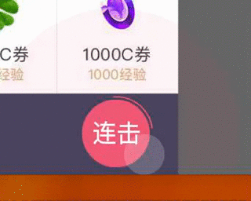
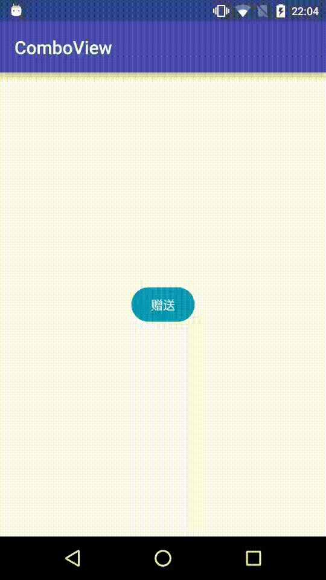

# ComboView
###A view of clicking effect by combo action


# UI Effect



# Final Effect




#How To Use
```java
  ComboView.Params params = ComboView.Params.create()
                .color(color(R.color.cb_color_blue), color(R.color.cb_color_blue))
                .colorPressed(color(R.color.cb_color_blue_dark), color(R.color.cb_color_blue_dark))

                //Following three to***** values must be the same can morph to circle
                .cornerRadius(dimen(R.dimen.cb_dimen_25), dimen(R.dimen.cb_dimen_52))
                .width(dimen(R.dimen.cb_dimen_70), dimen(R.dimen.cb_dimen_52))
                .height(dimen(R.dimen.cb_dimen_38), dimen(R.dimen.cb_dimen_52))

                //Can change from*** values and to*** values to see effect
                .strokeWidth(dimen(R.dimen.cb_dimen_1), dimen(R.dimen.cb_dimen_1))
                .strokeColor(color(R.color.cb_color_blue), color(R.color.cb_color_blue))
                .duration(400)
                .padding(dimen(R.dimen.cb_dimen_3))//padding between outer stroke and inner button
                .text("赠送", "连击")
                .textSize(16)
                .textColor(color(R.color.cb_color_white));

        comboView.settingMorphParams(params);

```

### Thanks [dmytrodanylyk](https://github.com/dmytrodanylyk) and his [android-morphing-button](https://github.com/dmytrodanylyk/android-morphing-button)


------

## License

Copyright 2016 Bruce too

Licensed under the Apache License, Version 2.0 (the "License");
you may not use this file except in compliance with the License.
You may obtain a copy of the License at

    http://www.apache.org/licenses/LICENSE-2.0

Unless required by applicable law or agreed to in writing, software
distributed under the License is distributed on an "AS IS" BASIS,
WITHOUT WARRANTIES OR CONDITIONS OF ANY KIND, either express or implied.
See the License for the specific language governing permissions and
limitations under the License.

See [LICENSE](LICENSE) file for details.
